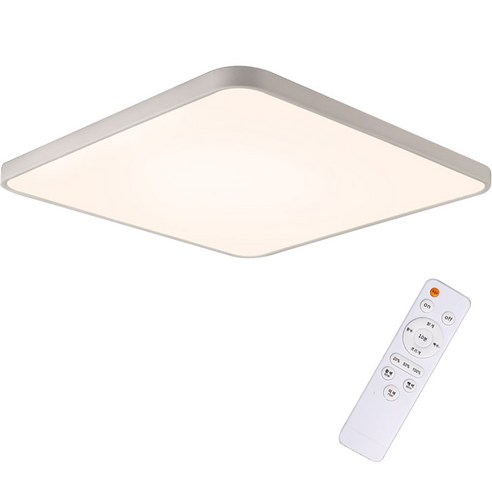
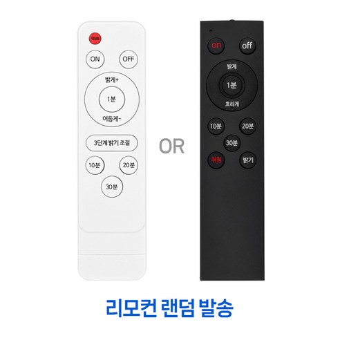

# 리모컨 

* 프로토콜: NEC 

| 제목                     | Code        | Address | Command | Data       |
|------------------------|-------------|---------|---------|------------|
| 붉은색 버튼(취침등)      | 0x157B609F  | 0xDEA8  | 0x6     | 0x157B609F |
| ON                     | 0x157BFF00  | 0xDEA8  | 0xFF    | 0x157BFF00 |
| Off                    | 0x157B807F  | 0xDEA8  | 0x1     | 0x157B807F |
| 윗버튼 (밝게 +)          | 0x157B00FF  | 0xDEA8  | 0x0     | 0x157B00FF |
| 아래 버튼 (어둡게 -)     | 0x157B50AF  | 0xDEA8  | 0xA     | 0x157B50AF |
| 좌측 버튼               | 0x157B906F  | 0xDEA8  | 0x9     | 0x157B906F |
| 우측 버튼               | 0x157BA857  | 0xDEA8  | 0x15    | 0x157BA857 |
| 중앙 버튼 OK (1분)       | 0x157B58A7  | 0xDEA8  | 0x1A    | 0x157B58A7 |
| 3단계 밝기 조절         | 0x157B50AF  | 0xDEA8  | 0xA     | 0x157B50AF |
| 10분                   | 0x157B6897  | 0xDEA8  | 0x16    | 0x157B6897 |
| 20분                   | 0x157B28D7  | 0xDEA8  | 0x14    | 0x157B28D7 |
| 30분                   | 0x157B10EF  | 0xDEA8  | 0x8     | 0x157B10EF |
| Repeat                 | 0xFFFFFFFFFFFFFFFF | -       | -       | 0xFFFFFFFFFFFFFFFF |

# 리모컨 사진




<details>
<summary>원본데이터</summary>

## 붉은색 버튼(취침등)
```
Protocol  : NEC
Code      : 0x157B609F (32 Bits)
uint16_t rawData[67] = {9004, 4532,  544, 592,  542, 594,  542, 596,  542, 1730,  568, 566,  542, 1730,  542, 592,  568, 1704,  546, 592,  544, 1732,  542, 1728,  544, 1730,  546, 1726,  546, 590,  544, 1750,  522, 1730,  544, 592,  542, 1730,  544, 1728,  544, 592,  544, 596,  540, 592,  544, 592,  544, 592,  544, 1730,  544, 592,  542, 592,  544, 1730,  542, 1732,  542, 1728,  544, 1730,  544, 1748,  524};  // NEC 157B609F
uint32_t address = 0xDEA8;
uint32_t command = 0x6;
uint64_t data = 0x157B609F;
```

## ON
```
Protocol  : NEC
Code      : 0x157BFF00 (32 Bits)
uint16_t rawData[71] = {8982, 4532,  542, 592,  544, 592,  566, 568,  568, 1706,  544, 592,  544, 1730,  542, 594,  542, 1730,  544, 590,  544, 1748,  524, 1728,  542, 1730,  542, 1732,  542, 592,  544, 1730,  542, 1730,  562, 1710,  544, 1730,  542, 1730,  568, 1706,  542, 1728,  544, 1730,  542, 1728,  544, 1730,  542, 594,  542, 594,  540, 614,  524, 594,  542, 594,  542, 596,  540, 594,  542, 612,  524, 38606,  9000, 2286,  542};  // NEC 157BFF00
uint32_t address = 0xDEA8;
uint32_t command = 0xFF;
uint64_t data = 0x157BFF00;
```

## Off 
```
Protocol  : NEC
Code      : 0x157B807F (32 Bits)
uint16_t rawData[71] = {9008, 4524,  550, 586,  550, 586,  550, 586,  550, 1720,  552, 586,  550, 1720,  552, 584,  552, 1720,  552, 584,  550, 1720,  552, 1722,  550, 1722,  550, 1720,  552, 584,  552, 1720,  552, 1724,  548, 1722,  550, 586,  550, 584,  550, 586,  550, 586,  550, 586,  550, 586,  550, 586,  550, 586,  550, 1722,  550, 1722,  550, 1720,  552, 1722,  550, 1722,  550, 1722,  550, 1722,  550, 38598,  9030, 2254,  564};  // NEC 157B807F
uint32_t address = 0xDEA8;
uint32_t command = 0x1;
uint64_t data = 0x157B807F;
```

## 윗버튼 (밝게 +)
```
Protocol  : NEC
Code      : 0x157B00FF (32 Bits)
uint16_t rawData[71] = {9028, 4506,  544, 590,  572, 564,  572, 566,  570, 1702,  548, 588,  570, 1702,  546, 590,  546, 1726,  544, 590,  546, 1728,  544, 1728,  572, 1702,  570, 1702,  546, 590,  570, 1704,  542, 1730,  542, 594,  568, 566,  544, 592,  544, 590,  568, 568,  544, 590,  544, 592,  544, 592,  544, 1728,  570, 1704,  544, 1728,  544, 1728,  544, 1728,  544, 1728,  546, 1726,  568, 1704,  570, 38574,  9000, 2302,  548};  // NEC 157B00FF
uint32_t address = 0xDEA8;
uint32_t command = 0x0;
uint64_t data = 0x157B00FF;
```

## 아래 버튼 (어둡게 -)
```
Protocol  : NEC
Code      : 0x157B50AF (32 Bits)
uint16_t rawData[71] = {9004, 4524,  548, 586,  548, 586,  548, 586,  550, 1722,  550, 586,  550, 1722,  550, 586,  548, 1724,  548, 588,  548, 1722,  550, 1722,  550, 1722,  550, 1722,  550, 584,  550, 1722,  550, 1722,  550, 586,  550, 1722,  550, 586,  550, 1724,  548, 586,  550, 586,  550, 586,  550, 586,  550, 1722,  550, 586,  550, 1724,  548, 586,  550, 1722,  548, 1722,  550, 1722,  550, 1724,  548, 38596,  9008, 2278,  550};  // NEC 157B50AF
uint32_t address = 0xDEA8;
uint32_t command = 0xA;
uint64_t data = 0x157B50AF;
```

## 좌측 버튼
```
Protocol  : NEC
Code      : 0x157B906F (32 Bits)
uint16_t rawData[71] = {9004, 4524,  550, 586,  550, 586,  548, 586,  550, 1724,  548, 586,  548, 1724,  548, 588,  548, 1722,  550, 586,  550, 1722,  550, 1722,  548, 1724,  550, 1722,  550, 586,  550, 1724,  548, 1722,  550, 1722,  550, 586,  550, 586,  550, 1722,  550, 586,  550, 586,  550, 588,  548, 586,  550, 588,  548, 1724,  548, 1724,  548, 586,  550, 1722,  550, 1722,  550, 1722,  550, 1722,  550, 38592,  9006, 2278,  550};  // NEC 157B906F
uint32_t address = 0xDEA8;
uint32_t command = 0x9;
uint64_t data = 0x157B906F;
```

## 우측 버튼
```
Protocol  : NEC
Code      : 0x157BA857 (32 Bits)
uint16_t rawData[71] = {9008, 4526,  550, 588,  548, 586,  550, 608,  528, 1746,  526, 586,  550, 1722,  550, 586,  548, 1724,  548, 586,  550, 1722,  550, 1722,  550, 1722,  550, 1722,  550, 586,  550, 1722,  550, 1722,  550, 1722,  550, 588,  548, 1722,  550, 586,  550, 1722,  550, 586,  550, 586,  550, 586,  550, 586,  550, 1722,  550, 586,  550, 1722,  550, 584,  550, 1722,  550, 1720,  550, 1722,  550, 38614,  8982, 2278,  550};  // NEC 157BA857
uint32_t address = 0xDEA8;
uint32_t command = 0x15;
uint64_t data = 0x157BA857;
```

## 중앙 버틑 OK (1분)
```
Protocol  : NEC
Code      : 0x157B58A7 (32 Bits)
uint16_t rawData[71] = {9030, 4500,  574, 564,  572, 562,  574, 564,  572, 1698,  574, 562,  574, 1698,  574, 562,  572, 1700,  572, 562,  574, 1698,  574, 1698,  574, 1698,  574, 1700,  572, 564,  572, 1698,  574, 1700,  572, 564,  572, 1700,  572, 562,  572, 1700,  574, 1698,  574, 564,  572, 562,  572, 562,  574, 1698,  572, 564,  572, 1698,  572, 564,  572, 564,  572, 1700,  572, 1700,  574, 1698,  574, 38568,  9026, 2258,  572};  // NEC 157B58A7
uint32_t address = 0xDEA8;
uint32_t command = 0x1A;
uint64_t data = 0x157B58A7;
```

## 3단계 밝기 조절
```
Protocol  : NEC
Code      : 0x157B50AF (32 Bits)
uint16_t rawData[71] = {9006, 4524,  550, 586,  550, 586,  550, 586,  550, 1722,  550, 586,  550, 1722,  550, 586,  550, 1722,  572, 564,  572, 1700,  550, 1722,  550, 1722,  550, 1724,  548, 586,  550, 1722,  550, 1722,  550, 586,  550, 1722,  550, 586,  550, 1722,  550, 586,  550, 584,  550, 586,  550, 586,  550, 1722,  550, 586,  550, 1722,  550, 586,  550, 1722,  550, 1722,  550, 1722,  550, 1722,  550, 38590,  9004, 2276,  550};  // NEC 157B50AF
uint32_t address = 0xDEA8;
uint32_t command = 0xA;
uint64_t data = 0x157B50AF;
```

## 10분
```
Protocol  : NEC
Code      : 0x157B6897 (32 Bits)
uint16_t rawData[71] = {9006, 4524,  550, 586,  550, 586,  550, 586,  550, 1722,  550, 586,  550, 1722,  550, 586,  550, 1722,  550, 586,  550, 1722,  550, 1722,  550, 1722,  550, 1722,  550, 586,  550, 1722,  550, 1722,  550, 586,  550, 1722,  550, 1722,  550, 586,  550, 1722,  550, 586,  574, 562,  550, 586,  550, 1722,  550, 586,  550, 586,  550, 1722,  550, 584,  550, 1722,  550, 1722,  550, 1722,  550, 38588,  9032, 2250,  550};  // NEC 157B6897
uint32_t address = 0xDEA8;
uint32_t command = 0x16;
uint64_t data = 0x157B6897;
```

## 20분
```
Protocol  : NEC
Code      : 0x157B28D7 (32 Bits)
uint16_t rawData[71] = {8982, 4526,  546, 586,  548, 586,  550, 586,  550, 1722,  550, 586,  550, 1722,  550, 586,  548, 1722,  550, 586,  550, 1722,  550, 1722,  550, 1722,  550, 1722,  550, 586,  550, 1722,  550, 1724,  548, 586,  550, 584,  550, 1722,  550, 586,  550, 1722,  550, 586,  550, 586,  550, 586,  550, 1722,  550, 1722,  550, 586,  550, 1722,  550, 586,  548, 1724,  550, 1722,  550, 1722,  550, 38590,  9004, 2278,  550};  // NEC 157B28D7
uint32_t address = 0xDEA8;
uint32_t command = 0x14;
uint64_t data = 0x157B28D7;
```

## 30분
```
Protocol  : NEC
Code      : 0x157B10EF (32 Bits)
uint16_t rawData[71] = {9002, 4522,  550, 586,  548, 586,  550, 586,  548, 1722,  550, 586,  548, 1724,  548, 586,  550, 1722,  550, 586,  550, 1724,  548, 1724,  548, 1722,  548, 1724,  548, 586,  550, 1722,  550, 1724,  548, 586,  550, 586,  548, 586,  550, 1722,  548, 586,  550, 586,  550, 584,  550, 588,  548, 1722,  550, 1724,  548, 1722,  550, 584,  550, 1722,  550, 1722,  550, 1722,  548, 1722,  550, 38584,  9006, 2276,  550};  // NEC 157B10EF
uint32_t address = 0xDEA8;
uint32_t command = 0x8;
uint64_t data = 0x157B10EF;
```

## Repeat
```
Protocol  : NEC (Repeat)
Code      : 0xFFFFFFFFFFFFFFFF (0 Bits)
uint16_t rawData[3] = {9028, 2256,  548};  // NEC (Repeat) FFFFFFFFFFFFFFFF
uint64_t data = 0xFFFFFFFFFFFFFFFF;
```

</details>